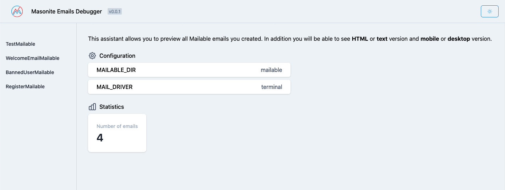
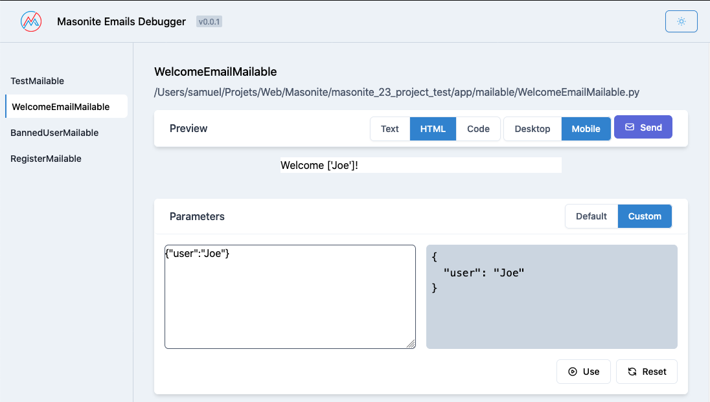
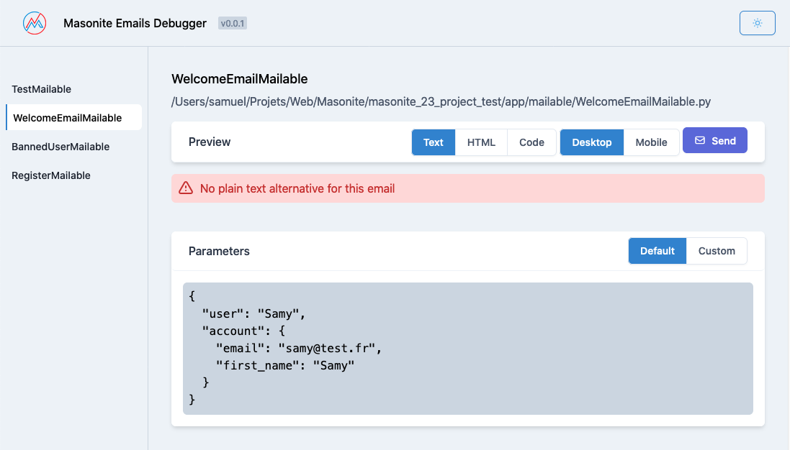

# Masonite Emails Viewer [WIP]
An email debug assistant for your Masonite project.

<p align="center">

</p>

[](https://github.com/girardinsamuel/masonite-emails-viewer/actions?query=workflow%3A%22Test+Application%22)

## Learning Masonite

Masonite strives to have extremely comprehensive documentation. All documentation can be [Found Here](https://masoniteframework.gitbooks.io/docs/content/) and would be wise to go through the tutorials there. If you find any discrepencies or anything that doesn't make sense, be sure to comment directly on the documentation to start a discussion!

Also be sure to join the [Slack channel](https://masoniteframework.gitbooks.io/docs/content/)!


## Screenshots





## Features
This assistant will parse all your `Mailable` classes.

* List of all your application emails
* Preview of your emails
  * Switch between `Plain text` version / `HTML` version / `HTML code`
  * Switch between `Mobile` and `Desktop` screen
* Quickly send the email
* See `variables` used in the email
* Edit live the variables inside the email


## Installation

Install the package

```bash
pip install masonite-emails-viewer
```

Configure the package in your Masonite project
```bash
python craft install:emails_viewer
```
This command will publish routes, controller, views and configuration file for the app.

Add the `EmailsViewerProvider` to your app:
```python
# config/providers.py
# ...
from masonite.emails_viewer import EmailsViewerProvider

# ...
PROVIDERS = [
    # Framework Providers
    AppProvider,
    AuthenticationProvider,

    #...
    EmailsViewerProvider,
]
```

Finally you have to publish the package assets in order to get access to the cool dashboard
```bash
python craft publish EmailsViewerProvider --tag assets
```

## Usage

Run your server and browse to `http://localhost:8000/emails`.
You now have a new route `/emails` where you can preview all your Mailable classes.

If you create a new mail with the `Mailable` class with `python craft mailable MyNewEmail`, after refreshing the page you shoud see your email in the sidebar.

You can add some placeholder parameters to your `Mailable` in order to have a instant preview of a real email. You can also directly input parameters from the preview.

## Configuration

* Change route ?
* Change mailable dir

## TODO
* easily editable route namespace
* add unit tests
* add better parsing of parameters from front to back
* DRY for the controller (autoloading ?)
* finish installation config and test it
* add dark mode
* open a PR in Masonite repo to add a feature to the Mailable class
* check CI
* add versioning and PyPi publish

## How to contribute
TO DO
